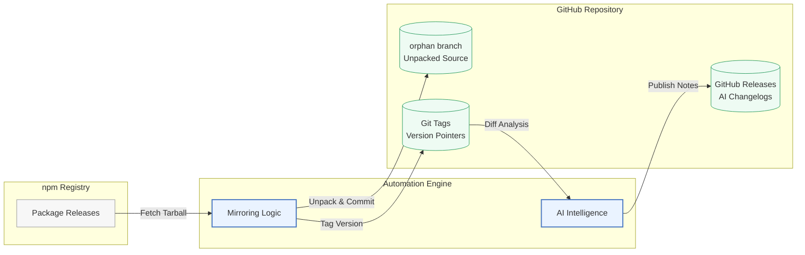

> [!IMPORTANT]
> **This repository is now archived**
> As the official repository [Tencent/openclaw-weixin](https://github.com/Tencent/openclaw-weixin) is now open-sourced, this mirror is no longer maintained. Please visit the official repository for the latest code and support.

[中文文档](README_CN.md)

# openclaw-weixin Mirror

This repository is an unofficial mirror of the npm package [`@tencent-weixin/openclaw-weixin`](https://www.npmjs.com/package/@tencent-weixin/openclaw-weixin). It is synchronized daily at 03:00 (UTC+8) via GitHub Actions to ensure the mirror stays up-to-date with the latest npm releases.

## Mission

- **Version mirroring**: Reliably synchronize `@tencent-weixin/openclaw-weixin` releases from npm into this repository with traceable history.
- **Source archival**: Preserve unpacked source snapshots on the `orphan` branch (one commit and one tag per version).
- **Release intelligence**: Generate English release notes from version diffs and README changes using the GitHub Copilot CLI.
- **Developer enablement**: Provide readable source, release notes, and historical traceability to support both human and AI-assisted analysis and extension.

## System Architecture



## Runtime And Tooling

- Runtime: Bun (native TypeScript execution)
- Language: TypeScript (ESM)
- Package manager: Bun
- AI Engine: GitHub Copilot CLI (`@github/copilot`)
- Linter/Formatter: Biome
- Main entrypoint: `scripts/index.ts`

## Browsing Versions

- **Source Code**: The un-minified source code for each version lives on the `orphan` branch, with a linear history (one commit per version).
- **By Tag/Version**: You can browse code for a specific version by running: `git checkout <version>` (e.g., `git checkout 1.0.0`). Note that tags do not have a `v` prefix.
- **Releases**: View AI-generated changelogs for each version in the [GitHub Releases](https://github.com/laojianzi/openclaw-weixin-mirror/releases) section of this repository.

## Local Development

Install dependencies:

```bash
bun install --frozen-lockfile
```

Run the full sync orchestration (check -> sync -> release):

```bash
bun run scripts/index.ts
```

Check code quality (lint & format):

```bash
bun run lint
```

Auto-fix code quality issues:

```bash
bun run format
```

Type-check scripts:

```bash
bun run typecheck
```

Run all tests:

```bash
bun test
```

## Automation

- **Main Branch**: All automation logic, including GitHub Actions workflows and TypeScript scripts used to synchronize the repository with the npm registry, is located on the `main` branch.
- **Process**: Versions are synced automatically via a scheduled GitHub Actions workflow. It executes `bun run scripts/index.ts`, which checks for unsynced versions, imports tarballs to `orphan`, and creates releases using the GitHub Copilot CLI for changelog generation.
- **CI Caching**: The workflow utilizes Bun's dependency caching to ensure fast and reliable execution.
