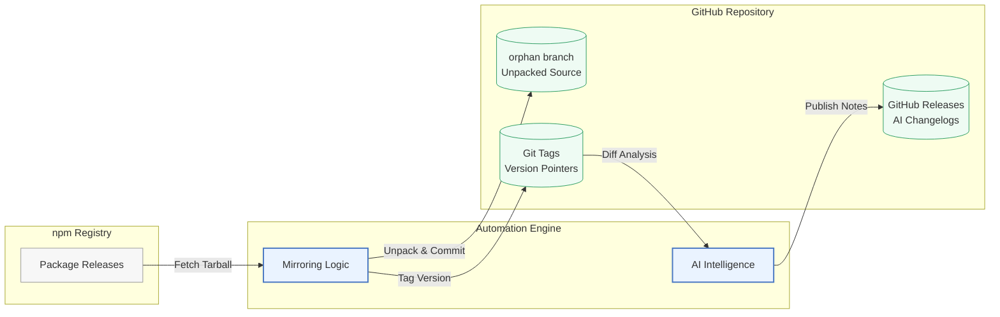

> [!IMPORTANT]
> **本仓库已归档**
> 由于官方仓库 [Tencent/openclaw-weixin](https://github.com/Tencent/openclaw-weixin) 已经正式开源，本镜像仓库停止维护。请前往官方仓库获取最新代码和支持。

# openclaw-weixin 镜像

本仓库是 npm 包 [`@tencent-weixin/openclaw-weixin`](https://www.npmjs.com/package/@tencent-weixin/openclaw-weixin) 的非官方镜像。它每天通过 GitHub Actions 在 03:00 (UTC+8) 进行自动同步，以确保本镜像库能够跟进最新的 npm 发布版本。

## 核心使命

- **版本镜像**：可靠地将 `@tencent-weixin/openclaw-weixin` 从 npm 同步至此仓库，并保持历史版本可追溯。
- **源码归档**：在 `orphan` 分支上保存解压后的源码快照（每个版本对应一个提交和一个标签）。
- **发布日志智能解析**：利用 GitHub Copilot CLI 根据版本差异和 README 的变更，自动生成英文版本的发布更新日志 (Release notes)。
- **开发者赋能**：提供高可读性的源码、更新日志以及历史追溯能力，从而为人类阅读及 AI 辅助分析和扩展提供支持。

## 系统架构



## 运行环境与工具链

- 运行环境: Bun (原生 TypeScript 执行)
- 开发语言: TypeScript (ESM)
- 包管理器: Bun
- AI 引擎: GitHub Copilot CLI (`@github/copilot`)
- 代码格式化/静态检查: Biome
- 主入口点: `scripts/index.ts`

## 浏览版本代码

- **源码文件**: 每次发布的非压缩源码快照均存放在 `orphan` 分支上，并保持线性历史（每个版本对应一次独立提交）。
- **按 Tag/版本 查找**: 你可以通过执行 `git checkout <version>`（例如 `git checkout 1.0.0`）来浏览特定版本的代码。注意这里的 tag 标签没有 `v` 前缀。
- **发布日志 (Releases)**: 在本仓库的 [GitHub Releases](https://github.com/laojianzi/openclaw-weixin-mirror/releases) 页面，可以查看由 AI 生成的各版本更新日志。

## 本地开发指南

安装依赖项:

```bash
bun install --frozen-lockfile
```

运行完整的同步编排流程 (检查 -> 同步 -> 发布):

```bash
bun run scripts/index.ts
```

检查代码质量 (静态检查与格式化):

```bash
bun run lint
```

自动修复代码质量问题:

```bash
bun run format
```

对脚本进行类型检查:

```bash
bun run typecheck
```

运行全部测试用例:

```bash
bun test
```

## 自动化部署

- **Main 分支**: 所有自动化相关逻辑均位于 `main` 分支，包括用于将仓库与 npm 同步的 GitHub Actions 工作流和 TypeScript 脚本。
- **处理流程**: 各个版本通过配置好的 GitHub Actions 定时任务自动进行同步。工作流会执行 `bun run scripts/index.ts`，检查是否存在尚未同步的版本，将对应的压缩包解压导入 `orphan` 分支，接着调用 GitHub Copilot CLI 生成更新日志，最后在仓库中创建 GitHub Release。
- **CI 缓存加速**: 自动工作流充分利用了 Bun 的依赖缓存机制，以保证执行过程兼具高效率和可靠性。